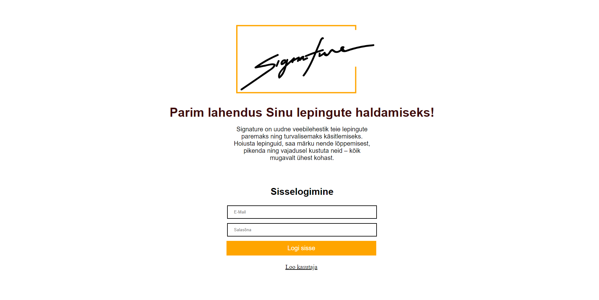

# Signature veebilehestik
# Suveprojekt praktika
#### http://greeny.cs.tlu.ee/~andrkal/Tarkvara_praktika/Suveprojekt/avaleht.php

### Tallinna Ülikool 2019 Digitehnoloogia instituut, informaatika eriala. Projekt on loodud Tarkvaraarenduse praktika raames.  

## Liikmed
* Grete Õunapuu
* Jaagup Aland
* Andri Kaljumäe
* Mia Eisler

## Eesmärk  
Põhieesmärk: Klientidele luua veebileht, kus saab hallata mitmeid erinevaid lepinguid turvaliselt ühes kohas. 

## Kirjeldus  
Klient saab endale luua kasutaja ja sisse logida. Kasutajana saab üles laadida lepinguid ning neid oma korda saab kõik mugavalt ühes tabelis uuendada, kustutada ja järjestada. Samuti annab tabel ülevaate peatselt lõppevatest lepingutest, mis lähevad tabelis teist värvi. 

## Ekraanitõmmis  

## Paigaldus
Meie projektiks on veebilehestik, mille kasutamiseks on vaja veebibrauserit. Meie soovituseks oleks kasutada Google Chrome'i kõige hilisemat versiooni. 

Leht asub hetkel Tallinna Ülikooli greeny serveris, kuhu saab näiteks läbi Putty tarkvara, kuid sealt saavad ligi ainult kasutajat omavad isikud. Lehekülje külastamiseks tuleb minna sellisel juhul: greeny.cs.tlu.ee/~andrkal/Tarkvara_praktika/Suveprojekt/avaleht.php

Juhised, kuidas paigaldada leht endale (väljaspool greeny serverit):

* Klooni GitHubi repositoorium: https://github.com/andrikaljumae/Suveprojekt/
* Kloonitud kausta luua uus kaust nimega "Uploads"
* Loo phpMyAdmin lehel andmebaasi tabelid (MySQL käsklused all pool)
* Mine asukohta, kuhu kloonisid GitHubi repositooriumi

### MySQL käsklused
Käsklused tuleb kopeerida phpMyAdmin lehel SQL-i lahtrisse. 

CREATE TABLE `kasutajad` ( `id` INT(11) NOT NULL AUTO_INCREMENT , `firstname` VARCHAR(30) CHARACTER SET latin1 COLLATE latin1_swedish_ci NOT NULL , `lastname` VARCHAR(30) CHARACTER SET latin1 COLLATE latin1_swedish_ci NOT NULL , `email` VARCHAR(100) CHARACTER SET latin1 COLLATE latin1_swedish_ci NOT NULL , `counter` INT(11) NOT NULL , `password` VARCHAR(60) CHARACTER SET latin1 COLLATE latin1_swedish_ci NOT NULL , `created` TIMESTAMP NOT NULL DEFAULT CURRENT_TIMESTAMP , PRIMARY KEY (`id`)) ENGINE = InnoDB;

CREATE TABLE `failid` ( `id` INT(10) NOT NULL AUTO_INCREMENT , `failinimi` VARCHAR(30) CHARACTER SET latin1 COLLATE latin1_swedish_ci NOT NULL , `algus` DATE NOT NULL , `lopp` DATE NOT NULL , `kasutaja_id` INT(30) NOT NULL , `Timestamp` DATE NOT NULL DEFAULT CURRENT_TIMESTAMP , PRIMARY KEY (`id`)) ENGINE = InnoDB;

## Config fail

<?php
	$serverHost = "xxxxxxxxxx";
	$serverUsername = "xxxx";
	$serverPassword = "xxxxxxxx";
	$uploads = "uploads/";
?>

## Kasutatud tehnoloogiad
* Visual Studio Code 1.35.1
* Atom 1.38
* Javascript
* HTML5
* PHP
* CSS3

## Litsents

See projekt on MIT litsendi all - vaata [LITSENTS](https://github.com/andrikaljumae/Suveprojekt/blob/master/LICENSE.md) täpsema info jaoks.

