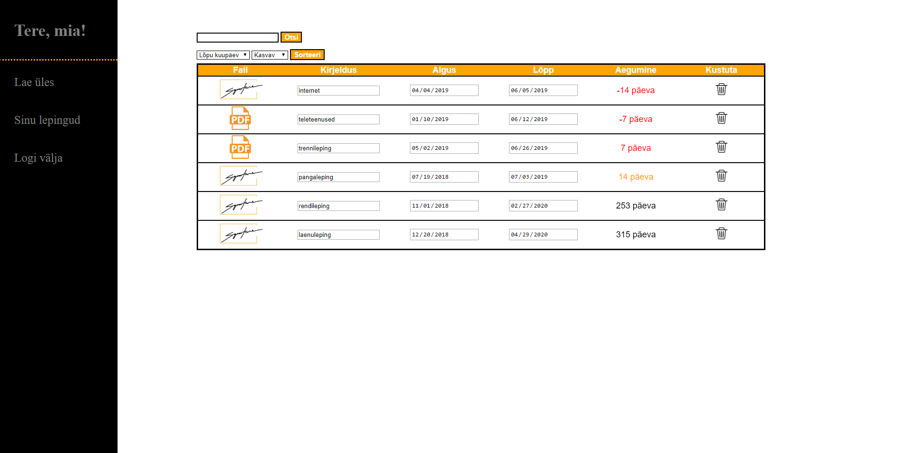

# Signature veebilehestik
# Suveprojekt praktika
## http://greeny.cs.tlu.ee/~andrkal/Tarkvara_praktika/Suveprojekt/avaleht.php

## Tallinna Ülikool 2019 Digitehnoloogia instituut, informaatika eriala. Projekt on loodud Tarkvaraarenduse praktika raames.  

## Liikmed
* Grete Õunapuu
* Jaagup Aland
* Andri Kaljumäe
* Mia Eisler

## Eesmärk  
Põhieesmärk: Klientidele luua veebileht, kus saab hallata mitmeid erinevaid lepinguid turvaliselt ühes kohas. 

## Kirjeldus  
Klient saab endale luua kasutaja ja sisse logida. Kasutajana saab üles laadida lepinguid ning neid oma korda saab kõik mugavalt ühes tabelis uuendada, kustutada ja järjestada. Samuti annab tabel ülevaate peatselt lõppevatest lepingutest, mis lähevad tabelis teist värvi. 

## Ekraanitõmmis  

## Paigaldus
// selgeid paigaldusjuhiseid ja arenduskeskkonna ülesseadmise juhised, et kes iganes saaks selle vajadusel käima (näiteks andmebaasi tabelid jm info peaks olema teksti kujul, et saaks kopeerida);//

## Kasutatud tehnoloogiad
* Visual Studio Code 1.35.1
* Atom 1.38
* Javascript
* HTML5
* PHP
* CSS3

## Litsents

See projekt on MIT litsendi all - vaata [LITSENTS](https://github.com/andrikaljumae/Suveprojekt/blob/master/LICENSE.md) täpsema info jaoks.

